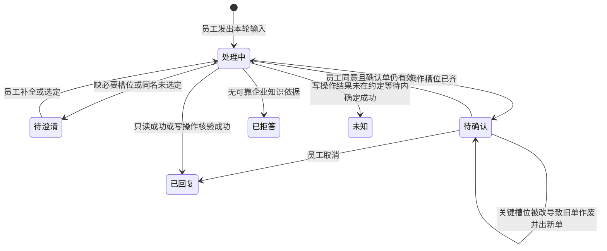
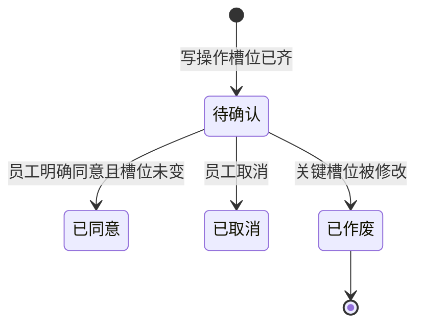
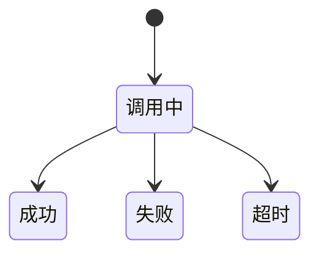

# 领域模型

## 1. 业务对象

| 对象 | 业务含义 | 创建者 | 生命周期 | 来源 Feature |
|---|---|---|---|---|
| 演示身份 | 当前使用者是谁、部门、读写权限；MVP 固定林小北｜产品部 | 系统注入，非 Feature 创建 | 进入工作台即存在，全程不变 | F-001 读取 |
| 对话 | 员工与助手的一次连续办事上下文 | F-001 | 进行中 | F-001 |
| 一轮提问 | 员工一句输入及助手为此给出的全部结果 | F-002 / F-003 / F-004 / F-005 | 处理中 → 已回复 / 待澄清 / 待确认 / 未知 / 已拒答 | F-002～F-005 |
| 意图 | 本轮要做的事 | 产生该轮的 Feature | 随本轮产生；澄清后可更新 | F-002～F-005 |
| 槽位 | 办事所需关键信息 | F-003 为主；其他 Feature 可有主题类槽位 | 空缺 → 已填 → 被修改 | F-003 |
| 路由决定 | 本轮走知识、走某个技能，还是走只读查询 | 产生该轮的 Feature | 随本轮固定 | F-002～F-005；F-006 对照 |
| 企业知识条目 | 可被引用的制度/手册片段 | 预置，员工只读 | 可用 | F-002 |
| 引用 | 答案所依据的文档、章节、原文片段 | F-002 | 附在该轮有据回答上 | F-002 |
| 确认单 | 写操作执行前展示给员工的待办摘要 | F-003 | 待确认 → 已同意 / 已取消 / 已作废 | F-003 |
| 技能 | 有名字的固定办事流程 | 预置 | 被命中后按固定步骤执行 | F-003，F-004 |
| 原子能力 | 找人、查日历、创建会议、取消息、查会议室等单一动作 | 预置 | 调用中 → 成功 / 失败 / 超时 | F-003，F-004，F-005 |
| 事件 | 本轮实际发生的一步，按时间进入事件流 | 产生该轮的 Feature | 追加后只读回放 | F-002～F-006 |
| 周报草稿 | 本轮生成的可编辑周报 | F-004 | 已生成 → 员工已修改 | F-004 |
| 工作消息 | 供周报抽取事实的本周消息（含闲聊与工作） | 预置 | 只读，本轮取用 | F-004 |
| 评测案例 | 带预期路由和 Bad Case 分类的演示用例；仅 Demo 验证台使用 | 预置 | 只读；对照通过 / 不通过；员工工作台不可见 | F-006（Demo Validation） |

## 2. 业务关系

| 对象 A | 关系 | 对象 B | 业务约束 |
|---|---|---|---|
| 演示身份 | 拥有 | 对话 | 只能看见和操作自己的对话 |
| 对话 | 包含 | 一轮提问 | 提问只属于当前对话；切换对话不带走未完成槽位与确认单 |
| 一轮提问 | 具有 | 意图 | 一轮一个当前意图 |
| 一轮提问 | 具有 | 路由决定 | 一轮一个路由决定；仅 Demo 验证台按此对照，员工工作台不展示对照表 |
| 一轮提问 | 产生 | 事件 | 只记录真实发生的步骤，未执行的不出现 |
| 一轮提问 | 可选具有 | 确认单 | 仅写操作需要；同时最多一张未作废的待确认单 |
| 确认单 | 绑定 | 槽位快照 | 槽位关键项变更后，该确认单必须作废 |
| 有据回答 | 具有 | 引用 | 拒答不得带假引用 |
| 引用 | 指向 | 企业知识条目 | 关键数字和条款必须能对上片段 |
| 创建会议技能 | 编排 | 原子能力 | 只编排找人 / 日历 / 会议，不开放自行规划 |
| 周报技能 | 使用 | 工作消息 | 周报事实 ⊆ 本轮取到的工作消息 |
| 周报技能 | 读取 | 演示身份的稳定偏好 | 偏好只影响模板、语言、篇幅 |
| 评测案例 | 回放 | 事件 | 只在 Demo 验证台只读回放，不创建会议、不写知识、不进入员工导航 |

## 3. 状态机

### 一轮提问

禁止：未确认或确认单已作废时进入「已回复且宣称会议已创建」；无引用依据时进入带制度答案的「已回复」。

### 确认单（仅 F-003）

已作废或已取消的确认单不得再触发创建。作废后必须产生新的待确认单才允许继续。

### 原子能力

创建会议的原子能力超时 → 本轮提问为未知，不得对员工宣称会议已创建。

## 4. 数据责任矩阵

| 业务对象 | Owner Feature | 创建 Feature | 写入 Feature | 读取 Feature | 删除/归档 Feature |
|---|---|---|---|---|---|
| 演示身份 | 平台注入 | 无 | 无 | F-001～F-006 | 无 |
| 对话 | F-001 | F-001 | F-001 | F-001～F-005 | MVP 不删除 |
| 一轮提问 | 产生该轮的 Feature | F-002 / F-003 / F-004 / F-005 | 同左 | 同左；F-006 只读回放预置轮次 | 无 |
| 意图 / 路由决定 | 产生该轮的 Feature | 同左 | 同左 | 同左；F-006 对照 | 无 |
| 槽位 | F-003 | F-003 | F-003 | F-003 | 随对话隔离，不跨对话写入 |
| 企业知识条目 | 预置 | 无 | 无 | F-002 | 无 |
| 引用 | F-002 | F-002 | 无 | F-002 | 随该轮存在 |
| 确认单 | F-003 | F-003 | F-003 | F-003 | 作废后不再使用 |
| 技能 / 原子能力定义 | 预置 | 无 | 无 | F-003，F-004，F-005 | 无 |
| 事件 | 产生该轮的 Feature | F-002～F-005 | 只追加 | F-002～F-006 | 无 |
| 周报草稿 | F-004 | F-004 | F-004 | F-004 | 无 |
| 工作消息 | 预置 | 无 | 无 | F-004 | 无 |
| 评测案例 | F-006 | 无 | 无 | F-006 | 无 |

## 5. 跨 Feature 数据流

| 起点 Feature | 产生结果 | 下游 Feature | 使用方式 | 不变量 |
|---|---|---|---|---|
| F-001 | 当前对话（空或已有上下文） | F-002 / F-003 / F-004 / F-005 | 在该对话中发起一轮提问 | 新对话不携带旧槽位、旧确认单 |
| F-002 | 已回复或已拒答的一轮提问 + 事件 | F-006（验证台） | 预置案例对照同类路由；员工工作台不展示对照 | 拒答轮次不得带假引用 |
| F-003 | 已回复 / 未知 / 待确认过程 + 事件 | F-006（验证台） | 预置成功、超时、确认作废案例 | 未有效确认不得创建会议；超时不得宣称成功 |
| F-004 | 周报草稿 + 事件 | F-006（验证台） | 预置周报路由案例 | 周报事实 ⊆ 本轮工作消息 |
| F-005 | 只读查询结果 + 事件 | F-006（验证台） | 预置查询路由案例 | 不产生确认单、不创建会议 |
| F-006 | 对照通过或不通过 | 无 | 不回写知识或会议；不出现在员工导航 | 评测操作不产生 F-003 成功会议 |
