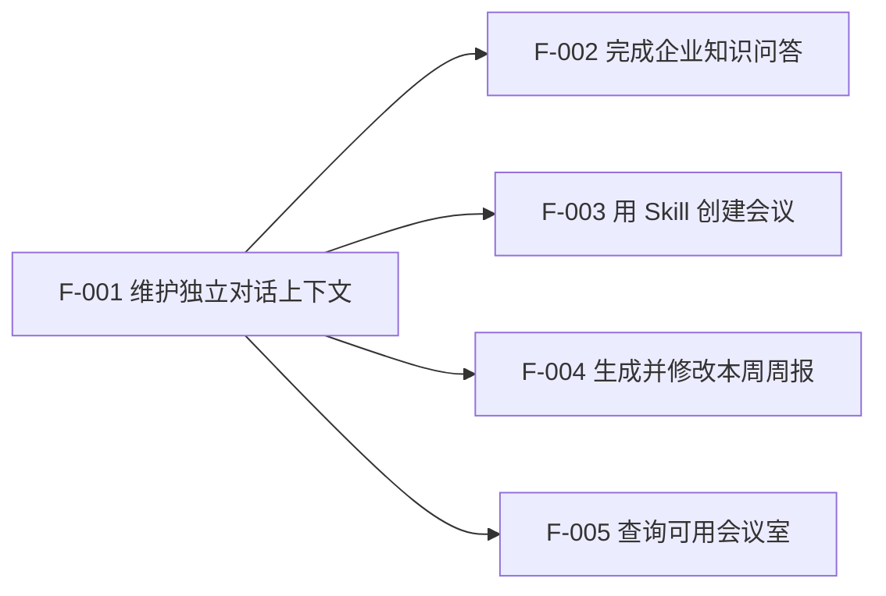

# Feature Map

## 1. Feature 总览

员工侧 MVP 产品 Feature 仅 F-001～F-005。F-006 为 Demo Validation Capability，不计入员工侧产品 Feature。

| Feature | 用户结果 | 角色 | 来源需求 | 依赖 | MVP/V2+ | Spec 状态 |
|---|---|---|---|---|---|---|
| F-001 维护独立对话上下文 | 员工能新建或切换自己的对话，旧槽位不串到新对话 | R-001 | 对话生命周期，BR-015 | 无 | MVP（员工产品） | Ready |
| F-002 完成企业知识问答 | 有依据则带引用作答，无依据则拒答且不编造 | R-001 | S-001，S-002，BR-001，BR-002，BR-013 | F-001 | MVP（员工产品） | Ready |
| F-003 用 Skill 创建会议 | 经澄清、消歧、确认且核验成功后会议才算创建；超时为未知；改关键槽位须重确认 | R-001 | S-003，S-006，S-007，BR-003～008，BR-012，BR-014 | F-001 | MVP（员工产品） | Ready |
| F-004 生成并修改本周周报 | 得到可编辑周报；事实来自本轮工作消息；闲聊不进正文 | R-001 | S-004，BR-009，BR-010，BR-017 | F-001 | MVP（员工产品） | Ready |
| F-005 查询可用会议室 | 查到明天下午 3 点后可用会议室；只读、不确认、不创建会议 | R-001 | S-005，BR-011 | F-001 | MVP（员工产品） | Ready |

### Demo Validation Capability（不计入员工侧 MVP 产品 Feature）

| ID | 名称 | 类型 | 角色 | 来源 | Spec 状态 |
|---|---|---|---|---|---|
| F-006 | 评测与 Bad Case 对照 | Demo Validation / Internal Demo Tool | R-002 | S-008，BR-016 | Ready |

入口：原型场景切换条，或独立路由 `/demo/evaluation`。禁止进入员工工作台正式导航。页面须标注「Demo Validation / 非产品功能」。员工侧不得出现预期路由、实际路由、通过/不通过、Bad Case 分类、评测案例列表。

V2+ 延后结果不分配 Feature ID，见 PRD 第 5 节，本轮不写 Spec。

## 2. Feature 依赖图

F-006 不依赖、也不被员工产品 Feature 依赖；只只读对照预置案例。

## 3. Feature 与页面/视图候选关系

| Feature | 需要的用户入口 | 可能承载页面/视图 | 是否跨页面 |
|---|---|---|---|
| F-001 | 对话入口、新建对话、最近对话列表 | 对话工作台（左栏会话 + 中栏对话） | 否 |
| F-002 | 当前对话输入、知识问答快捷入口 | 对话工作台（中栏消息 + 右栏本轮事件流 + 来源） | 否 |
| F-003 | 当前对话输入、执行任务快捷入口 | 对话工作台（中栏澄清/确认/结果 + 右栏本轮事件流） | 否 |
| F-004 | 当前对话输入、生成周报快捷入口 | 对话工作台（中栏周报草稿 + 右栏本轮事件流） | 否 |
| F-005 | 当前对话输入、查询信息快捷入口 | 对话工作台（中栏查询结果 + 右栏本轮事件流） | 否 |
| F-006 | 非产品入口：原型场景切换或 `/demo/evaluation` | Demo 验证台（非员工工作台） | 否 |

一个对话工作台承载 F-001～F-005。员工正式导航只保留「对话」与最近会话。

## 4. Feature 与业务数据关系

| Feature | 读取业务对象 | 创建业务对象 | 修改业务对象 | 关键状态变化 |
|---|---|---|---|---|
| F-001 | 演示身份、对话 | 对话 | 当前对话指向 | 新对话为空上下文；切换后不带旧槽位 |
| F-002 | 演示身份、对话、企业知识条目 | 一轮提问、意图、槽位、路由决定、引用、事件 | 一轮提问 | 处理中 → 已回复 / 已拒答 |
| F-003 | 演示身份、对话、技能、原子能力 | 一轮提问、意图、槽位、路由决定、确认单、事件 | 槽位、确认单、一轮提问 | 待澄清 / 待确认 / 已回复 / 未知；确认单 待确认 → 已同意 / 已取消 / 已作废 |
| F-004 | 演示身份、对话、技能、本轮工作消息、稳定偏好 | 一轮提问、周报草稿、事件 | 周报草稿 | 处理中 → 已回复；周报 已生成 → 员工已修改 |
| F-005 | 演示身份、对话、原子能力（会议室查询） | 一轮提问、意图、路由决定、事件 | 一轮提问 | 处理中 → 已回复（只读，无确认单） |
| F-006 | 评测案例、事件（只读回放） | 无 | 无 | 案例对照 通过 / 不通过；不写知识、不创建会议 |

## 5. 范围追踪

| PRD 场景/规则 | 覆盖 Feature | 覆盖状态 |
|---|---|---|
| S-001 | F-002 | 完整 |
| S-002 | F-002 | 完整 |
| S-003 | F-003 | 完整 |
| S-004 | F-004 | 完整 |
| S-005 | F-005 | 完整 |
| S-006 | F-003 | 完整 |
| S-007 | F-003 | 完整 |
| S-008 | F-006（Demo Validation，非员工产品 Feature） | 完整 |
| BR-001 | F-002 | 完整 |
| BR-002 | F-002 | 完整 |
| BR-003 | F-003 | 完整 |
| BR-004 | F-003 | 完整 |
| BR-005 | F-003 | 完整 |
| BR-006 | F-003 | 完整 |
| BR-007 | F-003 | 完整 |
| BR-008 | F-003 | 完整 |
| BR-009 | F-004 | 完整 |
| BR-010 | F-004 | 完整 |
| BR-011 | F-005 | 完整 |
| BR-012 | F-003 | 完整 |
| BR-013 | F-002，F-003，F-004，F-005（员工侧本轮事件流）；F-006（验证台回放） | 完整 |
| BR-014 | F-003 | 完整 |
| BR-015 | F-001 | 完整 |
| BR-016 | F-006 | 完整 |
| BR-017 | F-004 | 完整 |
