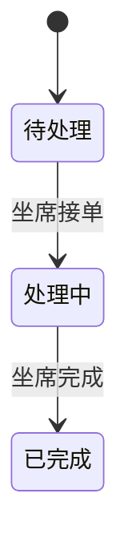

# 阶段 F：Feature 架构与功能规格

阶段 F 位于产品定义与 UI / 技术契约之间。它负责把 PRD 中的用户场景转换为可独立交付、可独立验收、可追踪到数据和测试的 Feature。

## 前置条件

- `docs/PRD.md` 存在
- PRD 包含状态为“已确认”的「产品定义确认记录」
- 用户已明确同意进入阶段 F

任一条件不满足，返回阶段 A，不得直接生成 Feature Map。

## 固定产出

```text
docs/
├── PRD.md
├── feature-map.md
├── domain-model.md
└── features/
    ├── F-001-<feature-slug>/
    │   └── spec.md
    ├── F-002-<feature-slug>/
    │   └── spec.md
    └── ...
```

本阶段只生成 `spec.md`，不生成 Feature `plan.md`。实施计划必须等原型、物理数据模型和 API 契约确认后，在阶段 C 生成。

## 核心定义

### Feature

Feature 是业务交付、Tester 验收、CI 追踪和用户门禁的最小单位。

一个 Feature 必须能写成：

```text
[角色] 在 [业务场景] 执行 [业务动作]，得到 [可观察的业务结果]。
```

### Task

Task 是未来供子智能体执行的技术工作单元。一个 Feature 可以包含多个 Task；接口、页面、数据库表、组件和单元测试都只能是 Feature 内部 Task 或产物，不能直接替代 Feature。

阶段 F 禁止生成 `.sdd/tasks.json`，也禁止为了适配当前代码结构而扭曲 Feature 边界。

## 执行顺序

```text
F1 从用户旅程提取候选 Feature
→ F2 依据统一规则拆分 / 合并 Feature
→ F3 建立 Feature Map 和依赖图
→ F4 建立领域模型、状态机和数据责任矩阵
→ F5 为每个 MVP Feature 生成 spec.md
→ F6 Feature Ready 自检与用户门禁
```

---

## F1：从用户旅程提取候选 Feature

逐个读取 PRD 的 MVP 场景，按“角色动作 → 业务结果”提取候选 Feature。

### 提取表

| 候选 Feature | 角色 | 触发条件 | 业务动作 | 可观察结果 | 来源场景 |
|---|---|---|---|---|---|
| 用户登录 | 员工 | 拥有有效账号 | 提交账号密码 | 进入工作台 | S-001 |

### 规则

- 不得从页面名称直接生成 Feature
- 不得从数据库实体直接生成 Feature
- 不得从 API 清单直接生成 Feature
- 一个候选 Feature 必须能指回至少一个 PRD 场景或业务规则
- 找不到来源的候选 Feature 视为范围扩张，必须删除或返回 PRD 重新确认

---

## F2：Feature 拆分与合并规范

### 合格 Feature 的六个条件

1. **单一用户结果**：只有一个主要业务目标
2. **明确角色**：知道谁触发、谁受益、谁被影响
3. **完整纵向闭环**：覆盖从用户动作到业务结果的完整链路，不能只覆盖单一技术层
4. **独立验收**：可以用一组明确场景判定 PASS / FAIL
5. **边界明确**：写清包含、不包含和失败终点
6. **依赖可表达**：前置 Feature 可以列成无环依赖

### 必须继续拆分的信号

出现任一情况时，候选 Feature 太大：

- 名称是“用户管理”“工单模块”“知识库系统”等大模块
- 同时包含两个以上可独立发布的用户结果
- 同时包含多个角色各自独立的主流程
- 验收标准需要大量“并且”才能描述
- 一部分失败时另一部分仍可独立成立
- 无法用一条主测试流程和少量异常流程验证
- 需要多个彼此独立的用户门禁

### 必须合并回其他 Feature 的信号

出现任一情况时，候选项太小，不能单独作为 Feature：

- 只有创建表、增加字段、开发 API、增加按钮、创建组件等技术动作
- 用户无法独立感知其价值
- 没有独立的触发条件或完成结果
- 必须依附另一个 Feature 才能验收

### 拆分示例

错误：

```text
F-001 用户管理
```

正确：

```text
F-001 用户登录
F-002 管理员创建员工账号
F-003 管理员停用员工账号
F-004 员工修改个人资料
F-005 员工重置密码
```

### Feature ID

- 项目内统一使用 `F-001`、`F-002`、`F-003`
- ID 创建后保持稳定；重命名 Feature 不得复用或重排已有 ID
- 验收标准使用 `AC-F001-01` 格式
- 文件夹使用 `F-001-user-login` 格式；slug 仅用于可读性，引用以 ID 为准

**门禁**：先向用户展示候选 Feature 的拆分 / 合并结果。用户确认功能边界后，才能进入 F3。

---

## F3：Feature Map 与依赖图

输出 `docs/feature-map.md`。

### 固定结构

````markdown
# Feature Map

## 1. Feature 总览

| Feature | 用户结果 | 角色 | 来源需求 | 依赖 | MVP/V2+ | Spec 状态 |
|---|---|---|---|---|---|---|
| F-001 用户登录 | 用户进入工作台 | 员工 | S-001, BR-001 | 无 | MVP | Draft |

## 2. Feature 依赖图


## 3. Feature 与页面/视图候选关系

| Feature | 需要的用户入口 | 可能承载页面/视图 | 是否跨页面 |
|---|---|---|---|
| F-001 | 登录入口 | 登录页 | 否 |

## 4. Feature 与业务数据关系

| Feature | 读取业务对象 | 创建业务对象 | 修改业务对象 | 关键状态变化 |
|---|---|---|---|---|
| F-004 转人工 | 会话、消息 | 工单 | 会话 | 无工单 → 待处理 |

## 5. 范围追踪

| PRD 场景/规则 | 覆盖 Feature | 覆盖状态 |
|---|---|---|
| S-001 | F-001, F-002 | 完整 |
````

### 依赖规则

- 依赖表示“前一个 Feature 的业务结果是后一个 Feature 的前置条件”
- 禁止仅因为会修改同一文件或表就建立业务依赖
- Feature 依赖图必须无环
- 出现循环依赖时，说明 Feature 边界或共同前置能力需要重新设计
- 纯技术基础设施不放入业务 Feature Map；阶段 C 可把它们作为实施任务处理

### 页面关系规则

页面在 Feature Map 之后确定：

- 一个页面可以承载多个 Feature
- 一个 Feature 可以跨多个页面或视图
- 页面不能决定 Feature 边界
- B1 的页面清单必须从已确认的 Feature 与用户旅程推导

**门禁**：用户确认 Feature 总览、依赖和页面候选关系后，才能进入 F4。

---

## F4：领域模型、状态机与数据责任

输出 `docs/domain-model.md`。

这一阶段定义业务对象的意义、关系、所有权和生命周期，不定义物理数据库字段。

### 固定结构

````markdown
# 领域模型

## 1. 业务对象

| 对象 | 业务含义 | 创建者 | 生命周期 | 来源 Feature |
|---|---|---|---|---|
| 工单 | 一次需要人工处理的问题记录 | F-004 | 待处理 → 处理中 → 已完成 | F-004/F-005/F-006 |

## 2. 业务关系

| 对象 A | 关系 | 对象 B | 业务约束 |
|---|---|---|---|
| 会话 | 具有 | 活动工单 | 同一会话最多一张未完成工单 |

## 3. 状态机



## 4. 数据责任矩阵

| 业务对象 | Owner Feature | 创建 Feature | 写入 Feature | 读取 Feature | 删除/归档 Feature |
|---|---|---|---|---|---|
| 工单 | F-004 | F-004 | F-005/F-006 | F-004/F-005/F-006 | 待定义 |

## 5. 跨 Feature 数据流

| 起点 Feature | 产生结果 | 下游 Feature | 使用方式 | 不变量 |
|---|---|---|---|---|
| F-004 | 待处理工单 | F-005 | 坐席领取 | 只能被一名坐席成功领取 |
````

### 边界规则

允许：

- 业务对象名称和业务含义
- 对象之间的业务关系
- 状态名称、转换条件和禁止转换
- 哪个 Feature 创建、读取、修改对象
- 跨 Feature 必须保持的不变量

禁止：

- SQL DDL
- 表名、列名、字段类型和索引
- ORM 类和迁移脚本
- API 路径、DTO 和响应 JSON

物理数据模型必须等全部 MVP Feature Spec 确认后，在阶段 C 由功能需求反推。

**门禁**：用户确认领域对象、状态机、数据责任和跨 Feature 不变量后，才能进入 F5。

---

## F5：为每个 MVP Feature 生成 spec.md

每个 MVP Feature 必须有独立规格文件：

```text
docs/features/F-001-user-login/spec.md
```

V2+ Feature 可以只保留在 Feature Map；如果本轮不开发，不强制生成完整 Spec，但必须标明状态和延后理由。

### spec.md 固定模板

```markdown
# F-001 用户登录功能规格

## 1. 功能身份

- Feature ID：F-001
- 功能名称：用户登录
- 所属版本：MVP
- 主要角色：员工
- 来源需求：S-001、BR-001
- 依赖 Feature：无
- 对应页面/视图候选：登录页
- Spec 状态：Draft / Ready / Changed
- Spec 版本：1

## 2. 用户结果

员工提交有效凭证后，可以进入工作台并保持有效登录状态。

## 3. 前置条件与触发条件

- 前置条件：
- 触发条件：

## 4. 功能范围

### 包含

- ...

### 不包含

- ...

## 5. 主流程

1. ...

## 6. 异常与边界流程

- ...

## 7. 业务规则与不变量

- 引用 BR-xxx
- ...

## 8. 业务数据读写

| 动作 | 业务对象 | 业务含义 | 数据 Owner |
|---|---|---|---|
| 读取 | 用户账号 | 验证账号是否有效 | platform / 账号管理 Feature |

## 9. 权限、隐私与安全约束

- ...

## 10. 外部服务与降级边界

- 依赖服务：
- 完整验收需要的权限：
- 缺失时允许的降级：
- 降级时不得宣称：

## 11. 验收标准

### AC-F001-01 登录成功

- Given：系统存在有效员工账号
- When：员工提交正确凭证
- Then：员工进入工作台并看到当前用户信息
- 验证类型：auto / agent / manual / external

### AC-F001-02 凭证错误

- Given：系统存在该账号
- When：员工提交错误密码
- Then：系统拒绝登录且不建立有效登录状态
- 验证类型：auto

## 12. 原型追踪

| AC | 页面/视图 | 关键交互 | 原型路径 |
|---|---|---|---|
| AC-F001-01 | 登录页 | 提交表单并跳转 | 阶段 B2 补充 |

## 13. 契约追踪

| AC | 数据模型 | API 契约 | 状态 |
|---|---|---|---|
| AC-F001-01 | 阶段 C 补充 | 阶段 C 补充 | Pending |

## 14. 变更记录

| Spec 版本 | 变更 | 影响 AC | 是否需要重新规划/测试 |
|---|---|---|---|
| 1 | 初始版本 | 全部 | 是 |
```

### 验收标准规则

每条 AC 必须：

- 有唯一 ID
- 使用 Given / When / Then
- 描述可观察结果，不描述实现步骤
- 可以明确判定 PASS / FAIL
- 只验证当前 Feature，不顺带验收其他 Feature
- 标明验证类型
- 覆盖至少一条失败、权限或边界场景（确实不适用时说明理由）

### 验证类型

| 类型 | 含义 | 后续要求 |
|---|---|---|
| `auto` | 可由确定性自动化测试验证 | 阶段 C 必须映射测试层级和命令 |
| `agent` | 需要 Agent 结合界面或语义判断 | Tester/Codex 输出证据 |
| `manual` | 需要用户业务判断 | CI 不能宣称自动完整通过 |
| `external` | 依赖真实外部服务或权限 | 缺失时只能标记降级验收 |

### Spec Ready 规则

只有满足以下条件，`Spec 状态` 才能从 `Draft` 改为 `Ready`：

- [ ] 用户结果单一明确
- [ ] 包含 / 不包含边界清楚
- [ ] 主流程和异常流程完整
- [ ] 业务规则与 Domain Model 一致
- [ ] 数据读写和 Owner 明确
- [ ] AC ID 唯一且可判定
- [ ] 每条 AC 标明验证类型
- [ ] 没有物理表字段、API DTO 或内部代码方案越界
- [ ] 没有 `TBD` 或无法执行的模糊表述

每个 Feature Spec 应逐个呈现给用户确认。未经确认不得标记 `Ready`。

---

## F6：Feature Ready 自检与总门禁

### 全局追踪检查

- [ ] PRD 中每个 MVP 场景至少被一个 Feature 覆盖
- [ ] 每个 Feature 都能追溯到 PRD 场景或业务规则
- [ ] Feature 依赖图无环
- [ ] 跨 Feature 数据 Owner 唯一明确
- [ ] 状态机转换有唯一业务动作来源
- [ ] 每个 MVP Feature 都有 `spec.md`
- [ ] 每个 MVP Feature Spec 状态均为 `Ready`
- [ ] AC ID 在项目内唯一
- [ ] 页面候选来自 Feature，页面结构没有改变 Feature 拆分边界
- [ ] 未提前锁死数据库字段和 API DTO

### 输出总结

```markdown
## 阶段 F 完成摘要

- MVP Feature 数量：
- V2+ Feature 数量：
- Ready Spec：
- 主要依赖链：
- 核心领域对象：
- 跨 Feature 状态机：
- 需要阶段 C 才确定的技术契约：
```

### 阶段门禁

向用户发起：

> Feature Map、Domain Model 和全部 MVP Feature Spec 已完成。请确认功能边界、依赖、数据责任和验收标准。确认后进入阶段 B1，根据 Feature 和 AC 设计页面与 UI 说明书。

未经用户确认，不得进入阶段 B1。
